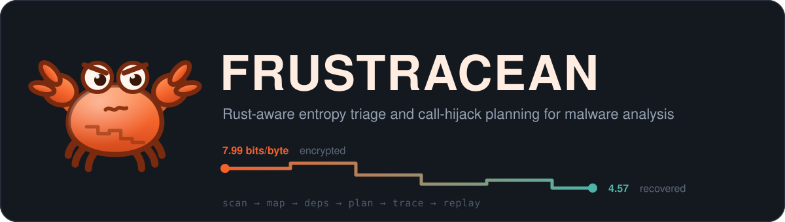
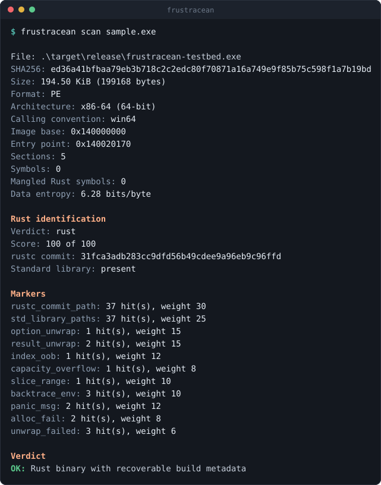
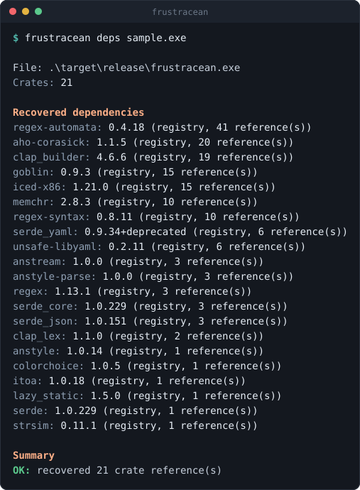
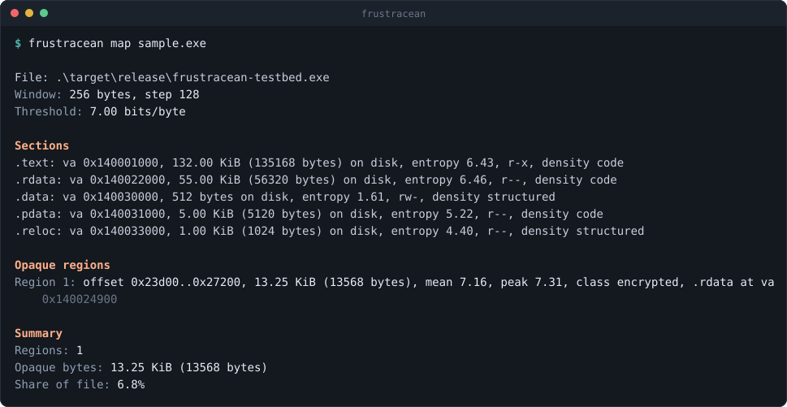
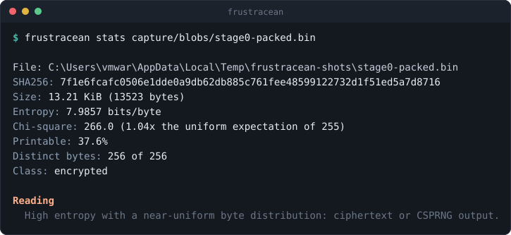
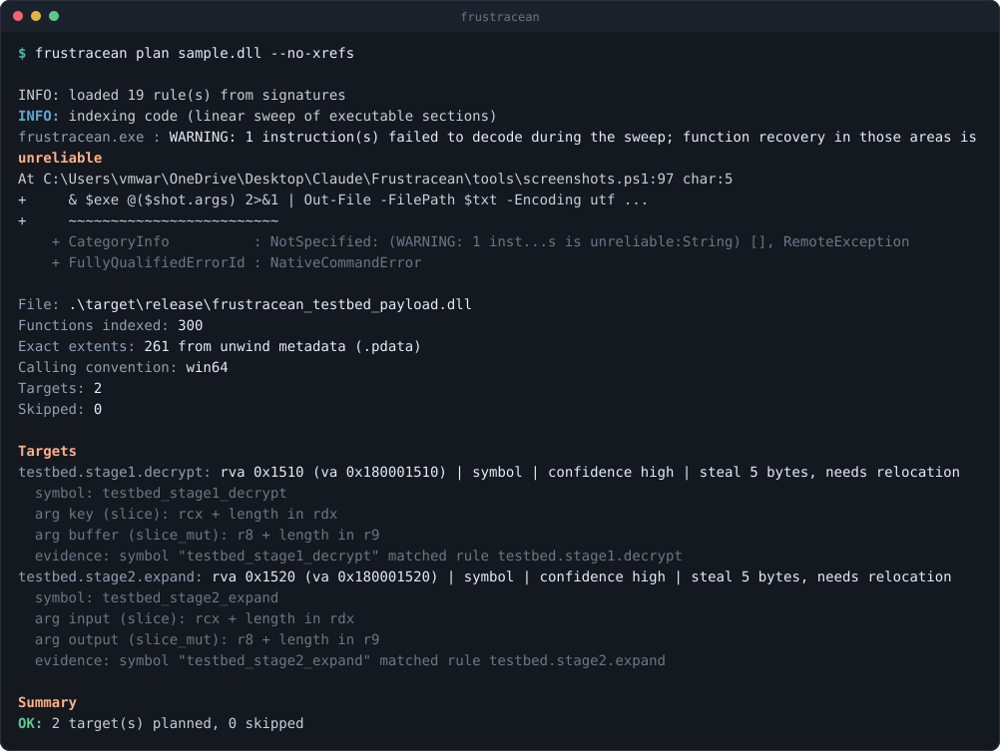
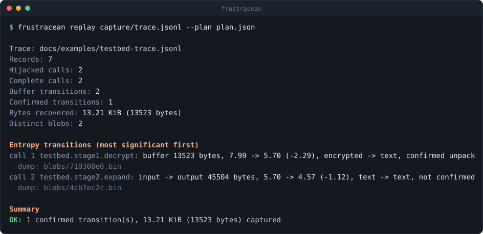

<p align="center">
  
</p>

<p align="center">
  <a href="https://github.com/dboudreau00/Frustracean/actions/workflows/ci.yml"></a>
  
  
  
  
</p>

---

**Frustration + crustacean.** A reverse-engineering toolkit for **Rust malware**,
written in Rust.

It profiles a sample, maps its entropy, recovers the crate inventory the compiler
left behind, and plans inline hooks on the functions known to turn opaque bytes
into readable ones — so the sample's own decryption code hands you the plaintext.

One question drives everything here:

> **Where in this binary does high entropy become low entropy, and what did it turn into?**

Companion to [Delpheed](https://github.com/dboudreau00/Delpheed-Delphi-Call-Hijacker),
which does the same job for Delphi. Where Delpheed unpacks by catching the OEP
under a debugger, Frustracean unpacks by hijacking the *calls* — because Rust
malware rarely ships a classic `PUSHAD` packer stub, and much more often reaches
for `aes-gcm`, `flate2`, and `litcrypt`.

---

## Contents

- [Why Rust needs its own tool](#why-rust-needs-its-own-tool)
- [What it looks like](#what-it-looks-like)
- [Build](#build)
- [The pipeline](#the-pipeline)
- [Commands](#commands)
- [How targets get resolved](#how-targets-get-resolved)
- [The entropy model](#the-entropy-model)
- [The signature catalogue](#the-signature-catalogue)
- [The bundled testbed](#the-bundled-testbed)
- [Build status](#build-status)
- [Running a sample](#running-a-sample)
- [Repository layout](#repository-layout)
- [Exit codes](#exit-codes)
- [Accessibility](#accessibility)
- [Scope and limits](#scope-and-limits)
- [Roadmap](#roadmap)
- [Licence](#licence)

---

## Why Rust needs its own tool

Rust binaries leak an unusual amount of build metadata, even stripped, and almost
none of it is where a C-oriented tool would look.

**The compiler embeds `file!()` for every panic site.** That puts
`/rustc/<40-hex commit>/library/core/src/...` in `.rodata`, pinning the *exact*
compiler — and, far more usefully, it puts
`.../registry/src/index.crates.io-<hash>/aes-gcm-0.10.3/src/lib.rs` there too.
Recovering that list is the single highest-value thing you can do to a Rust
sample before touching a disassembler: it tells you which crypto, which
compression, and which HTTP stack to expect.

**Rust string literals are length-prefixed slices, not NUL-terminated.** They are
packed into `.rodata` with *nothing between them*. Here is the tool's own
`strings` output over the bundled fixture — two distinct constants, run together
with no separator, followed immediately by a `rustc` path:

```
0x00021c18  FRUSTRACEAN_TESTBED::stage2/rle-expandFRUSTRACEAN_TESTBED::stage1/keystream-xor/rustc/31fca3ad…
```

Any regex over that data needs lazy quantifiers *and* an explicit leading
boundary, or it matches across literal edges. That is not a hypothetical; it
caused two real bugs in this codebase before the tests caught it.

**Symbols use two mangling schemes** — legacy `_ZN…17h<hash>E` and v0 `_R…` —
both carrying the owning crate in the path, when symbols survive at all. They
usually do not: an MSVC-linked Rust executable has *no symbol table whatsoever*.

**Payload code is monomorphised generic code from third-party crates.** There is
no `CryptDecrypt` import to breakpoint. The equivalent is
`<aes_gcm::AesGcm<..> as aead::AeadInPlace>::decrypt_in_place_detached`, and you
have to find it yourself.

And the one that shapes everything: **a packed sample has none of the above.**
The markers live inside the compressed blob, not the stub. Frustracean reports
that case explicitly as `obscured-by-packing` rather than concluding "not Rust".

---

## What it looks like

### Fingerprinting

`scan` answers *is this Rust, which compiler built it, and what is in it* — from
a stripped binary with zero symbols.



### Dependency recovery

`deps` reconstructs the crate list **with exact versions** out of embedded cargo
registry paths. This is the feature that changes how you approach a sample.



### Entropy mapping

`map` sweeps the file and merges the opaque runs into regions, attributing each
to its section.



### Measuring a blob

`stats` is what you run on something a trace recovered — or on any file at all.
Note the chi-square line: it is what separates *encrypted* from merely
*compressed*.



### Planning the hooks

`plan` resolves rules against the image and maps each logical Rust argument onto
an actual register. A `&[u8]` is a fat pointer, so it takes two.



### Reading the result

`replay` pairs entry and return records and reports what actually changed.



Look closely at the second line. Its entropy dropped by 1.12 bits and it is
still **not confirmed** — because its *input* was already readable text, so
nothing was recovered. A tool that counted that as a win would inflate every
chained sample's findings.

> These images are generated from real output by `tools/screenshots.ps1`, not
> drawn by hand. A stale screenshot shows up as a text diff.

---

## Build

Stable Rust. **No C toolchain** — every dependency is pure Rust.

```bash
cargo build --release
```

```bash
cargo test --workspace
```

On Windows, `tools/build.ps1` wraps both and reports where the artefacts landed.

Three binaries come out:

| Artefact | What it is |
|----------|------------|
| `frustracean` | The command-line tool |
| `frustracean_hook.dll` | The injected payload |
| `frustracean-testbed` | A benign sample that packs and unpacks itself |

Hook installation sits behind an off-by-default `detour` feature. The crate
builds without it, and `install` refuses with an explanation rather than
silently doing nothing.

---

## The pipeline

```
  sample.exe
      │
      ▼
  [binary]     parse PE/ELF: sections, symbols, VA ↔ file offset
      │        every header field is attacker-controlled, so all
      │        arithmetic is checked and every count is capped
      ▼
  [rustid]     is this Rust? which rustc? which crates? whose machine?
      │            │
      │            └──▶ few markers + opaque body ⇒ "obscured-by-packing",
      │                 which is a finding, not a negative
      ▼
  [entropy]    windowed Shannon + chi-square + printable ratio
      │        ⇒ regions classified padding / text / code /
      │          structured / compressed / encrypted
      ▼
  [disasm]     linear sweep: function starts from call targets,
      │        constants located through RIP-relative references
      ▼
  [signature]  the rule catalogue: which crate functions are worth hijacking
      │
      ▼
  [plan]       rules × symbols × prologue safety ⇒ HijackPlan (JSON)
      │        refusals recorded, never dropped
      ▼
  [hook]       ── isolated VM ── patch prologues, capture buffers
      │        ⇒ trace.jsonl + content-addressed blob dumps
      ▼
  [report]     pair entry/return by call id, compute entropy deltas,
               rank by what was actually recovered
```

---

## Commands

Every command takes `--quiet` (drop commentary, keep result lines). Most take
`--json`.

### Static — these never execute the sample

```
frustracean scan    <image>
frustracean deps    <image> [--all] [--json]
frustracean map     <image> [--window N] [--step N] [--threshold F]
                            [--min-region N] [--windows] [--json]
frustracean stats   <file>  [--json]
frustracean strings <image> [--min N] [--rust-only]
frustracean rules           [--signatures DIR] [--json]
frustracean plan    <image> [--signatures DIR] [--out FILE]
                            [--no-xrefs] [--include-unsafe] [--json]
frustracean replay  <trace.jsonl> [--plan FILE] [--out report.md] [--json]
```

| Command | Does |
|---------|------|
| `scan` | Identify the image and decide whether it is Rust |
| `deps` | Recover the crate inventory from embedded build paths |
| `map` | Entropy map and merged opaque regions |
| `stats` | Measure one blob: entropy, corroborators, class, hash |
| `strings` | Printable runs with file offsets and virtual addresses |
| `rules` | Load and validate the signature catalogue |
| `plan` | Resolve rules into a hijack plan |
| `replay` | Correlate a captured trace into a report |

Two `plan` flags change what gets resolved:

- `--no-xrefs` disables the string cross-reference fallback, leaving only
  symbol-resolved targets.
- `--include-unsafe` emits sites whose prologue **cannot** be patched safely.
  Hooking one corrupts the sample; it is for inspection only.

### Dynamic — this one runs the malware

```
frustracean trace <plan.json> --sample <exe> --sandboxed
                  [--out DIR] [--payload DLL] [--timeout SECS]
                  [-- <args passed to the sample>]
```

Windows only. See [Running a sample](#running-a-sample).

### A typical session

```bash
frustracean scan suspicious.exe
```

```bash
frustracean deps suspicious.exe
```

```bash
frustracean plan suspicious.exe --out plan.json
```

---

## How targets get resolved

Two paths feed the planner. Both run by default; `--no-xrefs` disables the
second.

### By symbol

The rule's regex matched a demangled name. High confidence, and rare in
practice — an MSVC-linked Rust executable carries no symbol table at all. You
mostly get this from DLLs, from `x86_64-pc-windows-gnu` builds that kept their
COFF table, and from ELF.

### By string cross-reference

The realistic case. A constant the crate is known to embed is located in
`.rodata`, its RIP-relative references are collected by a linear sweep, and the
enclosing functions become candidates.

This is a heuristic and is labelled as one:

- `min_string_hits` counts **distinct anchors**, not references. Ten references
  to one string is one piece of evidence repeated, not ten pieces.
- A single anchor yields **low** confidence. Two or more independent anchors
  yield **medium**. This path never yields high.
- Candidates are capped, and every refusal lands in `plan.skipped` with a
  reason — a coverage gap nobody writes down is a coverage gap nobody notices.

There is a real limit worth knowing. An anchor only survives into a binary if
its reference is *incidental* — a path inside a panic `Location`, a message the
formatter must be able to produce. A constant the optimiser can fold away will
be folded away. The bundled testbed hit exactly this: its first version's
anchors were const-evaluated out of existence before the linker ran, and it now
routes them through `black_box` to reproduce what real samples get for free.

### Before anything is hooked

Every candidate site is checked, and refused if:

- the address is not in an executable section — constant data decodes into
  plausible-looking instructions more often than is comfortable;
- fewer than 5 bytes can be decoded, or the function returns first;
- a branch elsewhere in the function lands *inside* the bytes that would be
  stolen;
- the address is already claimed by another target.

---

## The entropy model

Entropy alone is a blunt instrument. LZ-compressed data, AES ciphertext, and a
densely packed `.text` all sit in the 6.5–8.0 band. Frustracean carries two
cheap corroborators alongside every measurement.

**Chi-square against a uniform byte distribution.** True ciphertext and CSPRNG
output land near the expected 255. Compressors leave residual structure and
score far higher. This is the single most useful signal for separating
*encrypted* from *merely compressed* — and the numbers are not subtle:

| Buffer | Entropy | Chi-square | ×255 | Class |
|--------|---------|-----------|------|-------|
| Testbed packed blob | 7.986 | 266 | **1.04** | `encrypted` |
| After stage 1 | 5.696 | 109 024 | **427** | `text` |
| After stage 2 | 4.575 | 700 875 | **2749** | `text` |

**Printable ratio**, which pulls UTF-8 blobs — very common in Rust binaries,
whose string literals run together into long printable stretches — out of the
"data" bucket.

A transition is only **confirmed** when the input was genuinely opaque *and* the
entropy moved at least a full bit in the direction the rule predicted. Both
clauses matter: a drop from 7.9 to 7.4 is large but leaves the output still
opaque, and a drop from 4.0 to 3.5 says nothing because the input was never
packed in the first place.

---

## The signature catalogue

`signatures/*.yaml`, loaded in filename order so precedence is deterministic,
and validated at load time. 19 rules across crypto, compression, obfuscation,
and encoding.

Rules describe **logical Rust arguments**, not registers; the ABI mapping
happens in `plan`.

```yaml
- id: rust.crypto.aes_gcm.decrypt_in_place_detached
  crate: aes-gcm
  confidence: high
  match:
    demangled_regex: '<aes_gcm::AesGcm<.+> as aead::AeadInPlace>::decrypt_in_place_detached'
    strings: ["aes-gcm-0.10", "aes-gcm/src"]
    min_string_hits: 1
  abi:
    sret: false
    args:
      - {name: this,            kind: ptr}
      - {name: nonce,           kind: ptr}
      - {name: associated_data, kind: slice}      # two slots: ptr + len
      - {name: buffer,          kind: slice_mut}  # two slots
      - {name: tag,             kind: ptr}
  capture:
    when: both
    dump: [buffer]
    expect: entropy_drop
    max_bytes: 4194304
```

Three things bite when writing rules, and all three are documented in the
catalogue itself:

**`&[u8]` is a fat pointer** and consumes *two* ABI slots. Under Win64 a rule
with `ptr, ptr, slice, slice_mut` puts the second slice's pointer in `r9` and
its length on the stack at `[rsp+0x28]`.

**`sret` is calling-convention dependent.** Win64 returns a value in `RAX` only
when it is 1, 2, 4 or 8 bytes; SysV64 returns aggregates up to 16 bytes in
`RAX:RDX`. AES-GCM decryption returns `Result<(), Error>` and needs no hidden
pointer; AES-GCM *encryption* returns a 16-byte tag and does. Getting it wrong
shifts every subsequent argument silently.

**A separate output buffer needs `compare: {from, to}`.** A decompressor is
handed an *empty* output buffer, so comparing it against itself measures the
difference between zeroes and data — which is true, and useless.

Some crates get no rule on purpose. `goldberg` is a proc macro: its code runs
inside rustc and never links into the sample, so no registry path can appear and
a rule anchored on one would never fire. A rule that never fires is worse than
no rule, because it reads like evidence of absence.

---

## The bundled testbed

`crates/frustracean-testbed` is a benign, dependency-free sample that packs and
unpacks itself:

```
  STAGE1_BLOB          7.99 bits/byte   encrypted
       │  stage1_decrypt(key, buffer)          ← in place
       ▼
  RLE-compressed       5.70 bits/byte
       │  stage2_expand(input, output)         ← separate output buffer
       ▼
  plaintext config     4.57 bits/byte
```

It exists because the one unfinished piece of this project — the detour stub —
cannot be brought up against real malware. You need a target whose correct
output you already know, so that when a hook fires you can tell the difference
between *captured the buffer* and *corrupted the process*.

It is also two targets in one. Built as a **cdylib** it exports named symbols,
so rules resolve by `symbol_regex`. Built as an **executable** it is MSVC-linked
with no symbol table at all, so it can only be resolved through string
cross-references — the realistic case.

```bash
frustracean-testbed --dump ./stages
```

```bash
frustracean stats ./stages/stage0-packed.bin
```

Everything about it is asserted in its own tests, including that both stages
keep their entropy characteristics, that the plaintext appears nowhere in the
packed blob, and that the blob stays large enough for `map` to resolve it as a
region.

---

## Build status

Be clear about this before relying on it.

| Stage | State |
|-------|-------|
| `scan`, `deps`, `map`, `stats`, `strings`, `rules`, `plan`, `replay` | **Working.** Exercised against real binaries, 161 tests |
| Trampoline construction, prologue analysis, buffer capture, trace format | **Working.** Unit tested |
| Plan rebasing, prologue verification against recorded bytes | **Working.** Unit tested |
| Process launch and payload injection (`trace`) | **Written, not validated end to end** |
| The detour stub that fires on each hooked call | **Not implemented** |

So: the static half is real and usable today. The dynamic half will resolve a
plan against a live process, rebase it, verify every prologue still matches, and
tell you exactly what it found — but it will not yet capture calls, because the
detour stub is deliberately not faked.

Hand-written machine code running inside a hostile process cannot be validated by
writing it confidently; it needs bring-up against a benign target under a
debugger. `crates/frustracean-hook/src/detour.rs` documents the full design,
including the three things that make it harder than it looks:

1. **Stack discipline.** The detour is reached by `jmp`, so `rsp` still holds
   what the function expected. Before calling the trampoline it must pop the
   return address away and re-establish `rsp` so the `call` pushes into the same
   slot — otherwise every stack argument the function reads is off by one.
2. **The saved context cannot live on the stack.** Once the trampoline is
   called, the function owns everything below the original `rsp`, including any
   frame built there. It has to be parked in thread-local storage — which also
   makes the design naturally reentrant, since two threads can be inside one
   hooked function at once.
3. **Reentrancy into our own capture path.** Capture allocates, hashes, and
   writes to disk. If the hooked function is reachable from inside the
   allocator, the stub must detect re-entry and skip rather than recurse.

`docs/examples/testbed-trace.jsonl` is the acceptance criterion for that work:
a trace in the exact schema the payload must emit, populated with the fixture's
real measurements.

---

## Running a sample

`trace` executes live malware. That is the point — the sample's own code does
the unpacking — but it means the usual rules apply, and the tool enforces some
of them.

- **It refuses to run without `--sandboxed`,** and that check comes before every
  other validation, so you are told you need an isolated machine before you are
  told anything else is wrong. Use a disposable, network-isolated VM with a
  snapshot to revert to.
- **The plan is bound to the sample by SHA-256.** A plan built against a
  different build would hook whatever happens to sit at those offsets.
- **Every hook site is verified** against the bytes the planner recorded, before
  anything is written. A mismatch means the plan is stale or the sample has
  already rewritten its own code, and it is reported rather than patched over.
- **Buffer reads are clamped.** A length register is attacker-controlled the
  moment the sample notices it is being watched, so a nonsense length appears in
  the trace as evidence instead of as a fault.
- **The run is bounded** by `--timeout` (60s default) and the process is
  terminated afterwards.
- **No wall-clock timestamps are recorded,** only elapsed nanoseconds. A sample
  that fingerprints its analysis window should not get a free signal from the
  tool watching it.

One thing `trace` does **not** give you. `CREATE_SUSPENDED` stops the initial
thread before the *entry point*, not before everything — and loading the payload
is itself what runs the sample's **TLS callbacks**, a well-known anti-analysis
hiding place. Hooks are in place before `main`, but a sample that unpacks from a
TLS callback has finished before the first hook exists. Catching that needs a
debugger attach; it is on the roadmap.

None of this is containment. Nothing in this tool sandboxes anything.

---

## Repository layout

| Path | Role |
|------|------|
| `crates/frustracean-core/src/entropy.rs` | Shannon entropy, chi-square, region merging and classification |
| `crates/frustracean-core/src/binary.rs` | PE/ELF model: sections, symbols, address translation, ABI selection |
| `crates/frustracean-core/src/symbols.rs` | Rust demangling (legacy + v0) and crate attribution |
| `crates/frustracean-core/src/rustid.rs` | Rust fingerprinting: rustc version, crate inventory, build paths |
| `crates/frustracean-core/src/disasm.rs` | Prologue safety analysis and code indexing (iced-x86) |
| `crates/frustracean-core/src/signature.rs` | Rule catalogue model, loading, and validation |
| `crates/frustracean-core/src/plan.rs` | Rules × image ⇒ `HijackPlan`; ABI argument mapping |
| `crates/frustracean-core/src/trace.rs` | JSON Lines wire format between payload and analyst |
| `crates/frustracean-core/src/report.rs` | Entry/return correlation, entropy deltas, ranking |
| `crates/frustracean-core/tests/hostile_images.rs` | Crafted PE/ELF that must not crash the tool |
| `crates/frustracean-cli/src/main.rs` | The `frustracean` command |
| `crates/frustracean-cli/src/out.rs` | Accessible console output |
| `crates/frustracean-cli/src/inject.rs` | Suspended launch and payload injection |
| `crates/frustracean-hook/src/trampoline.rs` | Stolen-byte relocation and patch encoding |
| `crates/frustracean-hook/src/capture.rs` | Buffer clamping, content-addressed dumps, trace writing |
| `crates/frustracean-hook/src/detour.rs` | Plan rebasing, prologue verification; the stub's design |
| `crates/frustracean-testbed/` | Benign self-unpacking sample |
| `signatures/*.yaml` | The rule catalogue |
| `docs/examples/` | A real plan and a reference trace |
| `tools/` | Build, screenshot generation |

The crate split is load-bearing. `frustracean-hook` depends on core with
`default-features = false`, so the injected DLL carries the wire types and the
entropy math but **no binary parser, no YAML engine, and no regex engine**. It
does take a direct `iced-x86` dependency, because the trampoline has to
re-encode stolen bytes. CI checks the split holds.

---

## Exit codes

Shared with Delpheed, so the two script the same way.

| Code | Meaning |
|------|---------|
| 0 | Success |
| 1 | Bad or missing arguments |
| 2 | Input could not be read, or was not a valid image |
| 3 | Ran, but the operation did not succeed |

"Did not succeed" is a real outcome, not an error: `plan` exits 3 when it
resolves no targets, and `replay` exits 3 when nothing was confirmed.

---

## Accessibility

A command-line project, so "accessible" means terminal and screen-reader
friendly. Same conventions as Delpheed:

- status is carried by **words** (`OK:`, `ERROR:`, `WARNING:`, `INFO:`), never
  by colour;
- output is **linear and labelled** (`Name: value`), not aligned columns;
- no box drawing, spinners, or cursor tricks;
- **errors and warnings go to stderr**, results to stdout, so pipelines get
  clean data;
- `--quiet` drops decoration and keeps the result lines;
- every command returns a meaningful exit code.

---

## Scope and limits

- **x86 and x86-64 only** for anything involving disassembly. `scan`, `deps`,
  `map`, `stats`, and `strings` work on any PE or ELF; `plan` needs a decoder.
- **PE and ELF.** Mach-O is recognised and rejected rather than half-parsed.
- **Dynamic tracing is Windows-only,** and requires a 64-bit target — the
  payload is 64-bit, so a 32-bit plan is refused. The static commands run
  everywhere.
- **The Rust ABI is unstable.** The catalogue's argument models describe how
  rustc lowers these signatures *in practice* on x86-64, and `sret` is written
  for Win64. Check a rule against a disassembly before trusting a capture on an
  ELF sample.
- **Monomorphised generics may be inlined away entirely,** leaving no function
  to hook. The string anchors are the fallback, and they are lower confidence
  for a reason.
- **Linear sweep is the wrong algorithm for adversarial code** and the right one
  for compiler output. Decode failures and any capping are counted and reported
  rather than hidden.
- **A packed sample cannot be planned against directly.** The crate code is not
  in the image yet. Unpack the outer layer, then plan against the dump.
- **Strong protectors are out of scope.** Nothing here defeats virtualisation or
  serious anti-analysis.
- **Build-path recovery is heuristic.** Pooled literals have no separator, so a
  leading directory component is occasionally lost — the extractor prefers
  dropping a component to presenting debris as a real path.

---

## Roadmap

- **The detour stub.** The remaining piece: a wrapped-call detour with a
  per-thread frame stack in TLS and a re-entrancy guard, brought up against the
  bundled testbed under a debugger.
- **Debugger-based injection.** Attaching with `DEBUG_ONLY_THIS_PROCESS` and
  injecting at the initial breakpoint would land hooks ahead of the sample's TLS
  callbacks, which the current approach cannot.
- **Dump-and-replan.** When `trace` confirms an unpack, feed the recovered blob
  straight back through `scan`/`plan` — a second-stage Rust payload has its own
  crate inventory, and the markers missing from the packed outer layer are
  present in the dump.
- **Call-ordering analysis in the report.** A base64 decode whose output becomes
  a cipher's input is the shape of a staged loader; the trace already records
  enough to spot it.
- **Structural detection for compile-time obfuscators.** `goldberg` leaves
  branch density and entropy that are wrong for compiler output. That needs a
  measurement in `rustid`, not a string anchor.
- **More families.** Network and persistence rules, plus `windows`-crate
  wrappers around the Win32 calls a loader actually makes.

---

## Contributing

See [CONTRIBUTING.md](CONTRIBUTING.md). The one principle: **never claim more
than you have verified.** A tool that tells an analyst something false is worse
than one that tells them nothing, because the analyst will act on it.

Security issues go through [SECURITY.md](SECURITY.md) — and please do not attach
live malware to a public issue.

---

## Licence

MIT. See [LICENSE](LICENSE).

Intended for malware analysis, incident response, and security research on
samples you are authorised to examine.
